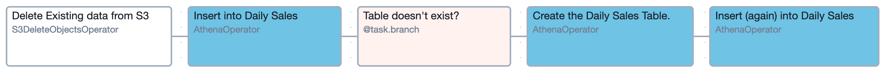
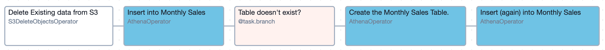

# Airflow DAGs for TPC-H Daily/Monthly Sales Aggregation

Companion repository for the Blog Post: [Building Data Aggregation Pipelines using Apache Airflow and Athena](https://www.tecracer.com/blog/2024/09/building-data-aggregation-pipelines-using-apache-airflow-and-athena.html) on the tecRacer AWS Blog (also available on [my blog](https://mauricebrg.com/2024/09/building-data-aggregation-pipelines-using-apache-airflow-and-athena.html) and [dev.to](https://dev.to/aws-builders/building-data-aggregation-pipelines-using-apache-airflow-and-athena-7gd)).

Two DAGs that can be used in conjunction with those in [../dag-tpch/](../dag-tpch/) to generate daily / monthly sales data aggregations.

The DAG for Daily sales is [here](./daily_sales_aggregation.py) and looks like this:

The DAG for Monthly sales is [here](./monthly_sales_aggregation.py) and looks like this:

