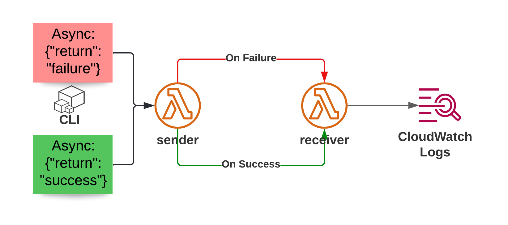

# Lambda Destinations Demo

## Blog Post

This belongs to my blog post on Lambda Destinations:

- dev.to (to be added)
- aws-blog.de (to be added)

## Architecture

## How to use

1. Deploy the CDK App (requires CDK version >= 2.20)
1. In the output, you'll find two commands (`CdkLambdaDestinationsStack.invokefailure` + `CdkLambdaDestinationsStack.invokesuccess`) - run these agains the same environment you deployed the app in
1. Inspect the output of the receiver Lambda. It may take a few seconds for the failure event to show up, because the Lambda service performs a few retries.