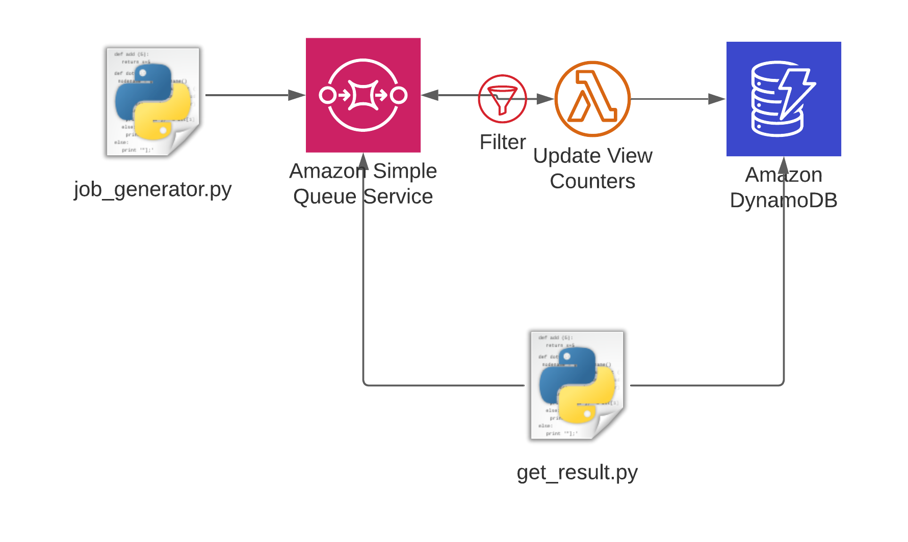

# Lambda SQS Filter

This is the companion code to my blog post about the investigation into the new Lambda SQS Event Filter.

## Architecture



## Prerequisites

- Python version >= 3.6
- CDK version >= 2.4


## Setup

1. Clone the repository and navigate to this directory
2. Create a virtual environment

```
$ python3 -m venv .venv
```

3. Activate the virtual environment

```
$ source .venv/bin/activate
```

If you are a Windows platform, you would activate the virtualenv like this:

```
% .venv\Scripts\activate.bat
```

4. Once the virtualenv is activated, you can install the required dependencies.

```
$ pip install -r requirements.txt
```

5. At this point you can now deploy the resources to AWS

```
$ cdk deploy
```

## Run the code

First we run the job_generator that adds messages to the queue.

```terminal
$ python job_generator.py
Removing summary item from table
Purging Queue
Purging queues can take up to 60 seconds, waiting...
Sending Message Group 1 with 2 messages
Sending Message Group 2 with 2 messages
Sending Message Group 3 with 2 messages
Sending Message Group 4 with 2 messages
Sending Message Group 5 with 2 messages
Sending Message Group 6 with 2 messages
Sending Message Group 7 with 2 messages
Sending Message Group 8 with 2 messages
Sending Message Group 9 with 2 messages
Sending Message Group 10 with 2 messages
Sending Message Group 11 with 2 messages
Sending Message Group 12 with 2 messages
Sending Message Group 13 with 2 messages
Sending Message Group 14 with 2 messages
Sending Message Group 15 with 2 messages
Sending Message Group 16 with 2 messages
Sending Message Group 17 with 2 messages
Sending Message Group 18 with 2 messages
Sending Message Group 19 with 2 messages
Sending Message Group 20 with 2 messages
```

Wait a few seconds to give the asynchronous Lambda function time to update the counters.

```terminal
$ python get_result.py   
Lambda processed 20 records
The Queue contained 0 messages
```