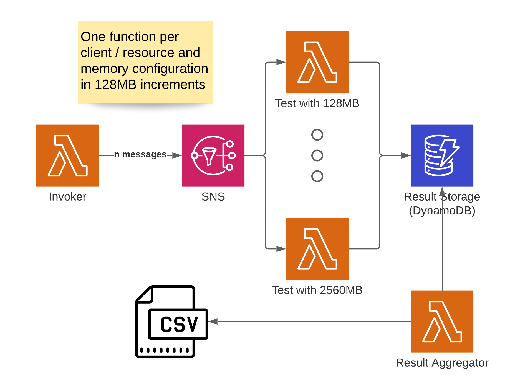
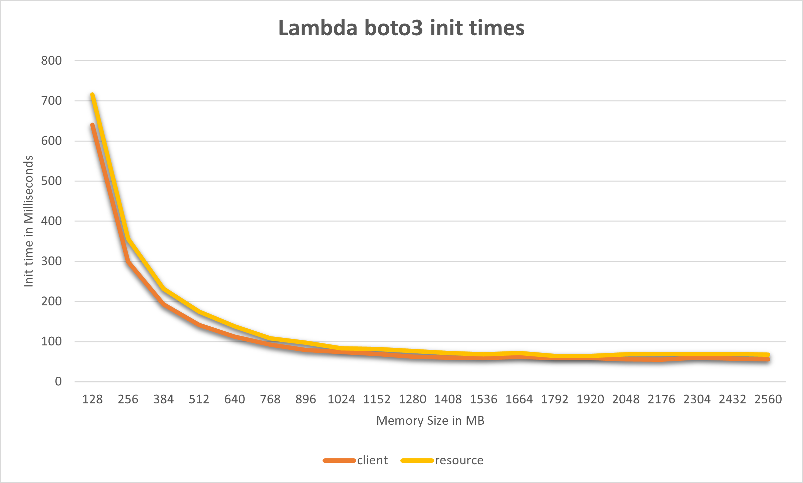

# Boto3 Init Times in different Lambda configurations

This is the companion repo to my (soon to be published) blog post about the influence of the Lambda memory size in the time it takes to initialize the first boto3 client or resource in your Lambda function after a cold start.

## Architecture

This CDK app deploys the infrastructure to measure how long it takes to initialize the first boto3 resource or client after a lambda cold start for different memory configurations.

To do that, we have an invocation mechanism that consists of a Lambda function that sends `n` messages to an SNS topic.
This SNS topic is then used to trigger a set of Lambda functions with different memory configurations that take the measurements and record the results in a DynamoDB table.
The lambda functions then also update themselves to make sure the next measurements get taken in a fresh (cold) execution context in order not to skew the results.
Lastly there is a Lambda function to fetch the results from DynamoDB and aggregate them into a little CSV file.



## Try it yourself

### Prerequisites

- The CDK in version >= 1.87.1, install via `npm install -g aws-cdk`
- Python in version >= 3.7
- An AWS Account :-)

### Setup

1. Clone the repo and navigate to this directory
2. Run `python -m venv .venv` to create a virtual environment (`python3` on Mac/Linux)
3. Activate the virtual environment by calling `source .venv\bin\activate`
4. Install the dependencies using `pip install -r requirements.txt`
5. Run `cdk synth` to verify everything is set up correctly
6. Deploy the architecture to AWS with the CDK: `cdk deploy`, approve the creation of IAM resources.

### Run it yourself

The output of `cdk deploy` shows two functions which you're going to need:

```text
Outputs:
cdk-python-lambda-init.invokerFn = cdk-python-lambda-init-experimentinvokerfunctionB6-17SC5JUNTOAL4
cdk-python-lambda-init.resultAggregatorFn = cdk-python-lambda-init-resultaggregator1ED9DB61-1F0I2CYMTM6NM
```

The `invokerFn` is used to start the measurements.
You can send it an empty event or one that looks like this:

```json
{
    "n": 100
}
```

Where 100 is the amount of samples you want to collect. Once you invoke the function, it will start the measurements.

You can then use the `resultAggregatorFn` to collect the results from the table and aggregate them as the name suggests.

Run the function with any event, it doesn't matter. In the logs you'll find a csv-formatted table with the measurements, which you can then import into something like Excel to make pretty graphs.

### Customization

To customize the amount of functions that get created as well as the increments and min and max memory, edit these variables in `infrastructure/cdk_python_lambda_init_stack.py`:

```python
LAMBDA_MEMORY_MIN_SIZE_IN_MB = 128
LAMBDA_MEMORY_INCREMENTS_IN_MB = 128
LAMBDA_MEMORY_MAX_SIZE_IN_MB = 2560
```

(Don't forget to do a `cdk deploy` afterwards.)

Have fun!

### Teardown

Run `cdk destroy` to remove the infrastructure. The Lambda log groups will remain, I couldn't figure out how to set the removal policies on those in an easy way - the rest should be completely deleted ;-)


## Results

### Graph



### Measurements

| Memory Size (MB) | client init (ms) | resource init (ms) |
|------------------|------------------|--------------------|
| 128              | 640              | 716                |
| 256              | 299              | 356                |
| 384              | 193              | 232                |
| 512              | 141              | 174                |
| 640              | 112              | 138                |
| 768              | 92               | 108                |
| 896              | 79               | 97                 |
| 1024             | 74               | 83                 |
| 1152             | 69               | 81                 |
| 1280             | 62               | 76                 |
| 1408             | 60               | 71                 |
| 1536             | 59               | 68                 |
| 1664             | 61               | 71                 |
| 1792             | 59               | 64                 |
| 1920             | 59               | 64                 |
| 2048             | 56               | 68                 |
| 2176             | 55               | 69                 |
| 2304             | 60               | 69                 |
| 2432             | 57               | 69                 |
| 2560             | 56               | 67                 |