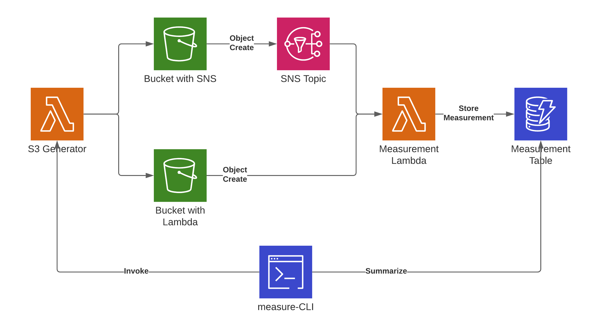

# Investigating S3 event latency

## Introduction

I was curious how long S3 takes to send out events for new objects being uploaded to a bucket.
That's because in a recent project we had an event-driven process that used the S3 - SNS - Lambda integration to process data.
After some complaints about performance I looked into that and discovered that S3 seems to take about three seconds to send out an event.
In this repo you can find code to analyze the situation.

## Architecture

This CDK app creates an architecture to test the latency of S3 events.
A lambda function is used to create objects in two S3-Buckets.
One bucket uses SNS to distribute events and the other talks to a Lambda function directly.
Said lambda function is also connected to the SNS topic and is responsible for measuring the latency.
The measurements are stored in a DynamoDB table.

A CLI application called `measure` that ships with the CDK app can be used to start the generator and create a summary of the measurements.
For details see the measure and cleanup sections.



## Setup 

### Prerequisites

- Python v3.7+ installed
- CDK v1.72+ installed
- Clone the repo/download the code

### Installation

1. Run `python3 -m venv .env` to create a new virtual environment (just `python` on windows)
2. Activate the virtual environment with `source .env\bin\activate` or the equivalent on windows
3. Run `pip install -r requirements.txt` to install all the dependencies for the cdk app
4. Run `cdk deploy` to deploy the App to AWS.
5. Setup done, now you can run the measurements.

## Measure

After you've installed the app, you can measure how long the events take to arrive at the target system.
To do that, we invoke a lambda function to create `n` files in each source bucket.
These files are tiny, so you shouldn't incur significant costs.

Run `measure start n` to achieve that - `n` is optional, its default value is 100.

```bash
$ measure start 1000
Loading environment information...
Done.
Invoking the function to create 1000 objects... this might take a while.
Done.
```

Afterwards you should wait a couple of seconds for the measuring lambda function to process the results.
Then you can run `measure summary` to get a summary of the results, it will look something like this:

```bash
$ measure summary
Loading environment information...
Done.
Exporting values for bucket cdk-s3-sns-latency-bucketwithlambdaintegrationeb6-7yiyh5q2dw30
Got 1000 values...
[S3 -> Lambda] Mean latency for cdk-s3-sns-latency-bucketwithlambdaintegrationeb6-7yiyh5q2dw30: 7126.978
[S3 -> Lambda] Min latency for cdk-s3-sns-latency-bucketwithlambdaintegrationeb6-7yiyh5q2dw30: 6331
[S3 -> Lambda] Max latency for cdk-s3-sns-latency-bucketwithlambdaintegrationeb6-7yiyh5q2dw30: 8320
[S3 -> SNS] Mean latency for cdk-s3-sns-latency-bucketwithlambdaintegrationeb6-7yiyh5q2dw30: -1
[S3 -> SNS] Min latency for cdk-s3-sns-latency-bucketwithlambdaintegrationeb6-7yiyh5q2dw30: -1
[S3 -> SNS] Max latency for cdk-s3-sns-latency-bucketwithlambdaintegrationeb6-7yiyh5q2dw30: -1
[SNS -> Lambda] Mean latency for cdk-s3-sns-latency-bucketwithlambdaintegrationeb6-7yiyh5q2dw30: -1
[SNS -> Lambda] Min latency for cdk-s3-sns-latency-bucketwithlambdaintegrationeb6-7yiyh5q2dw30: -1
[SNS -> Lambda] Max latency for cdk-s3-sns-latency-bucketwithlambdaintegrationeb6-7yiyh5q2dw30: -1
Exporting values for bucket cdk-s3-sns-latency-bucketwithsnsintegration6bc71b-4m59pgdr4osl
Got 1000 values...
[S3 -> Lambda] Mean latency for cdk-s3-sns-latency-bucketwithsnsintegration6bc71b-4m59pgdr4osl: 3010.771
[S3 -> Lambda] Min latency for cdk-s3-sns-latency-bucketwithsnsintegration6bc71b-4m59pgdr4osl: 489
[S3 -> Lambda] Max latency for cdk-s3-sns-latency-bucketwithsnsintegration6bc71b-4m59pgdr4osl: 8304
[S3 -> SNS] Mean latency for cdk-s3-sns-latency-bucketwithsnsintegration6bc71b-4m59pgdr4osl: 2917.06
[S3 -> SNS] Min latency for cdk-s3-sns-latency-bucketwithsnsintegration6bc71b-4m59pgdr4osl: 368
[S3 -> SNS] Max latency for cdk-s3-sns-latency-bucketwithsnsintegration6bc71b-4m59pgdr4osl: 8183
[SNS -> Lambda] Mean latency for cdk-s3-sns-latency-bucketwithsnsintegration6bc71b-4m59pgdr4osl: 93.701
[SNS -> Lambda] Min latency for cdk-s3-sns-latency-bucketwithsnsintegration6bc71b-4m59pgdr4osl: 44
[SNS -> Lambda] Max latency for cdk-s3-sns-latency-bucketwithsnsintegration6bc71b-4m59pgdr4osl: 345
```

The output shows you the different latencies that have been measured - for the direct S3 -> Lambda integration there are no values for the SNS measurements, you can safely ignore the `-1` values.

## Clean up

You can run `measure clear` to delete the data from DynamoDB and the S3-Buckets, it will look something like this:

```bash
$ measure clear
Loading environment information...
Done.
Are you sure you want to delete 2000 items from table cdk-s3-sns-latency-measurementtableE2283FE9-1USTIHDET5985? [y/N]: y
Got keys: PK, SK
Deleting Items...  [####################################]  100%          
Clearing Bucket cdk-s3-sns-latency-bucketwithsnsintegration6bc71b-4m59pgdr4osl
Deleted 1000 objects from cdk-s3-sns-latency-bucketwithsnsintegration6bc71b-4m59pgdr4osl
Clearing Bucket cdk-s3-sns-latency-bucketwithlambdaintegrationeb6-7yiyh5q2dw30
Deleted 1000 objects from cdk-s3-sns-latency-bucketwithlambdaintegrationeb6-7yiyh5q2dw30
```

Afterwards you can run `cdk destroy` to remove the infrastructure, it should be completely cleaned up.
