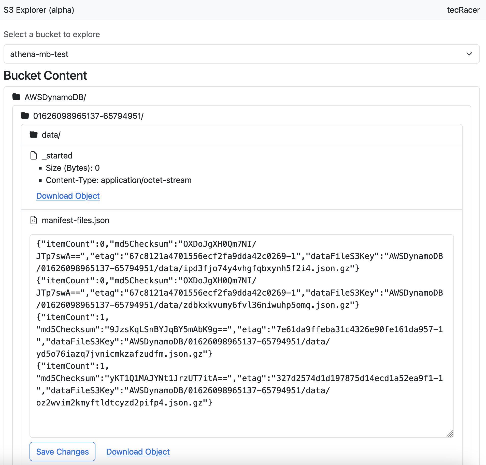
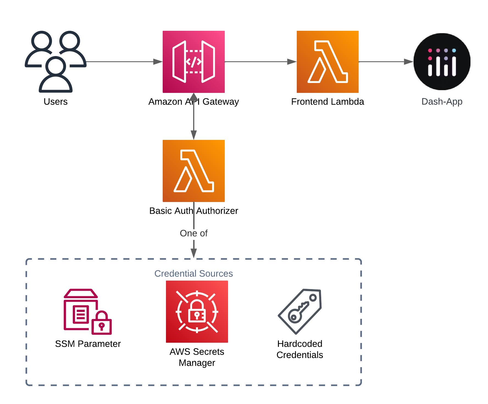

# Serverless S3 Explorer (alpha)

This is the alpha version of a S3 Explorer app built using Dash and deployed to a Lambda function running behind an API Gateway.
Access to the app is restricted through HTTP Basic Auth, which is handled by a custom Authorizer Lambda function.





It uses [AWS SAM](https://aws.amazon.com/serverless/sam/) to build and deploy the infrastructure.

A detailed description of the basic setup can be found in this blog post: [Deploying a Serverless Dash App with AWS SAM and Lambda](https://www.tecracer.com/blog/2024/03/deploying-a-serverless-dash-app-with-aws-sam-and-lambda.html)

An explanation of the Basic Auth setup is available here: [Adding Basic Authentication to the Serverless Dash App](https://www.tecracer.com/blog/2024/03/adding-basic-authentication-to-the-serverless-dash-app.html)

A blog post explaining this app can be found here: [Build a Serverless S3 Explorer with Dash](https://www.tecracer.com/blog/2024/04/build-a-serverless-s3-explorer-with-dash.html)

# Code

The main webapp is located in `frontend/dash_app.py`.
The authorizer Lambda with the different backends is available in `basic_auth_authorizer/basic_auth.py`

```text
├── README.md
├── Taskfile.yml
├── basic_auth_authorizer
│   └── basic_auth.py
├── events
├── frontend
│   ├── Dockerfile
│   ├── app.py
│   ├── assets
│   ├── dash_app.py
│   ├── pages
│   │   └── s3_explorer.py
│   └── requirements.txt
├── samconfig.toml
├── template.yaml
└── tests
    ├── integration
    │   └── test_api_gateway.py
    ├── requirements.txt
    └── unit
        ├── test_basic_auth.py
        └── test_handler.py
```

The `app.py` is the entry point for the Lambda function and takes care of translating the API Gateway event into something that Dash can understand (using [apig-wsgi](https://pypi.org/project/apig-wsgi/)).

# Authentication Backends

The authentication backends are implemented in `basic_auth_authorizer/basic_auth.py`.
This app supports the following credential providers:
- `SSM` (default) - add your username and password values to the SSM parameter that the stack deploys, format:
    ```json
    {"username": "password"}
    ```
- `SECRETSMANAGER` - uncomment the resources and policies in the `template.yaml`, deploy the app and insert the credentials in the secret like this:
    ```json
    {"username": "password"}
    ```
- `HARDCODED` - not recommended and commented out by default, add static credentials to the code - see `basic_auth_authorizer/basic_auth.py`

You can switch between these options by editing the `CREDENTIAL_PROVIDER_NAME` environment variable for the authorizer function in the `template.yaml`.

If you're cost conscious, I suggest you use the SSM Parameter option, it decouples the credentials from the code while not incurring additional cost.

# Deployment

## Prerequisites

- Python >= 3.11 should be installed, ideally Python 3.12
- SAM CLI
- Docker

## Steps to deploy

1. Check out this repository and navigate into the directory
1. Run `sam validate`, you should see a green output confirming that everything is fine
1. Run `sam build` to bundle the Lambda function and create the SAM template
1. Run `sam deploy --guided` to deploy the infrastructure in your account.
    - Ensure that SAM creates an ECR repository to which the docker image can be uploaded
    - `Create managed ECR repositories for all functions? [Y/n]: Y`
1. By default the SSM authentication backend is enabled and you need to add your credentials to the SSM Parameter in this format:
    ```json
    {"username": "password"}
    ```
1. After doing that, you should be able to access the website when you enter the credentials after being prompted for them.

Note, that the Authorizer Lambda caches the credentials from the valid credentials from the credential provider for performance reasons, that means it can take a while for credential updates to be reflected. If you want to force an update, you need to cause a redeployment of the Authorizer Lambda, e.g. through adding/updating an environment variable.

If you don't like this caching mechanism, just comment our the `@lru_cache` decorators on the functions and redeploy once. This will result in slightly higher latency, though.

## Running locally

This repository comes with a [Taskfile](taskfile.dev). To run the app locally, you can run `task local-frontend`

# Tests

The code comes with a few simple tests for the dash app and more detailed tests for the authorizer that can be executed like this:

1. Install the dependencies:
    - `pip install -r frontend/requirements.txt`
    - `pip install -r tests/requirements.txt`
1. Run the tests: `python -m pytest tests`
