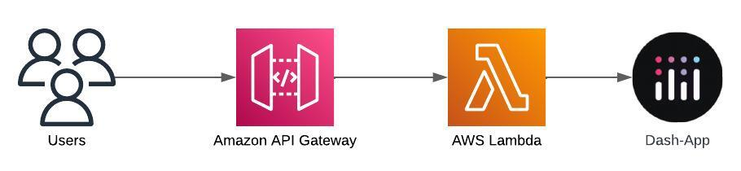

# SAM Serverless Dash

This is an example that shows you how to run a Serverless Dash App in a Lambda Function behind an API Gateway.



It uses [AWS SAM](https://aws.amazon.com/serverless/sam/) to build and deploy the infrastructure and implements a simple demo webapp:


A detailed description of the setup can be found in this blog post: [Deploying a Serverless Dash App with AWS SAM and Lambda](https://www.tecracer.com/blog/2024/03/deploying-a-serverless-dash-app-with-aws-sam-and-lambda.html)

# Code

The main webapp is located in `frontend/dash_app.py`.

```text
frontend
├── __init__.py
├── app.py
├── assets
│   └── architecture.jpeg
├── dash_app.py
└── requirements.txt
```

The `app.py` is the entry point for the Lambda function and takes care of translating the API Gateway event into something that Dash can understand (using [apig-wsgi](https://pypi.org/project/apig-wsgi/)).

# Deployment

## Prerequisites

- Python >= 3.11 should be installed, ideally Python 3.12
- SAM CLI

## Steps to deploy

1. Check out this repository and navigate into the directory
1. Run `sam validate`, you should see a green output confirming that everything is fine
1. Run `sam build` to bundle the Lambda function and create the SAM template
1. Run `sam deploy` to deploy the infrastructure in your account. Enter `y` to confirm that you want to deploy the Changeset.

# Tests

The code comes with a few simple tests that can be executed like this:

1. Install the dependencies:
    - `pip install -r frontend/requirements.txt`
    - `pip install -r tests/requirements.txt`
1. Run the tests: `python -m pytest tests`