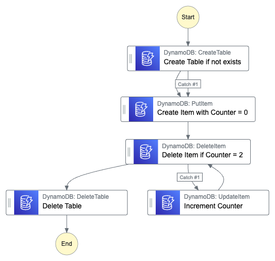

# Stepfunction Retries and Error Handling Demo

The App will deploy this stepfunction and an appropriate IAM Role:



## Setup

To deploy this CDK app, you need Python >= 3.9 and the CDK.

Next, you clone the repository, navigate into this directory and create and activate the virtual environment.

```
$ python3 -m venv .venv
```

After the init process completes and the virtualenv is created, you can use the following
step to activate your virtualenv.

```
$ source .venv/bin/activate
```

If you are a Windows platform, you would activate the virtualenv like this:

```
% .venv\Scripts\activate.bat
```

Once the virtualenv is activated, you can install the required dependencies.

```
$ pip install -r requirements.txt
```

At this point you can now synthesize the CloudFormation template for this code.

```
$ cdk synth
```

If all of this works, you can deploy the app using `cdk deploy`

## Stepfunction

The CDK App will create the following Stepfunction (see `infrastructure.py`).
You can also deploy it manually through the console, but you'll have to provide an IAM role with the permissions listed below.

### Definition

```json
{
  "StartAt": "Create Table if not exists",
  "States": {
    "Create Table if not exists": {
      "Next": "Create Item with Counter = 0",
      "Catch": [
        {
          "ErrorEquals": ["DynamoDb.ResourceInUseException"],
          "Next": "Create Item with Counter = 0"
        }
      ],
      "Type": "Task",
      "Resource": "arn:aws:states:::aws-sdk:dynamodb:createTable",
      "Parameters": {
        "AttributeDefinitions": [
          {
            "AttributeName": "pk",
            "AttributeType": "S"
          },
          {
            "AttributeName": "sk",
            "AttributeType": "S"
          }
        ],
        "BillingMode": "PAY_PER_REQUEST",
        "TableName": "sfn-retries-demo",
        "KeySchema": [
          {
            "AttributeName": "pk",
            "KeyType": "HASH"
          },
          {
            "AttributeName": "sk",
            "KeyType": "RANGE"
          }
        ]
      }
    },
    "Create Item with Counter = 0": {
      "Next": "Delete Item if Counter = 2",
      "Retry": [
        {
          "ErrorEquals": ["DynamoDb.ResourceNotFoundException"],
          "IntervalSeconds": 3,
          "MaxAttempts": 4,
          "BackoffRate": 2
        }
      ],
      "Type": "Task",
      "Resource": "arn:aws:states:::aws-sdk:dynamodb:putItem",
      "Parameters": {
        "Item": {
          "pk": {
            "S": "dummy"
          },
          "sk": {
            "S": "dummy"
          },
          "counter": {
            "N": "0"
          }
        },
        "TableName": "sfn-retries-demo"
      }
    },
    "Delete Item if Counter = 2": {
      "Next": "Delete Table",
      "Catch": [
        {
          "ErrorEquals": ["DynamoDb.ConditionalCheckFailedException"],
          "Next": "Increment Counter"
        }
      ],
      "Type": "Task",
      "Resource": "arn:aws:states:::aws-sdk:dynamodb:deleteItem",
      "Parameters": {
        "Key": {
          "pk": {
            "S": "dummy"
          },
          "sk": {
            "S": "dummy"
          }
        },
        "TableName": "sfn-retries-demo",
        "ConditionExpression": "#counter = :limit",
        "ExpressionAttributeNames": {
          "#counter": "counter"
        },
        "ExpressionAttributeValues": {
          ":limit": {
            "N": "2"
          }
        }
      }
    },
    "Increment Counter": {
      "Next": "Delete Item if Counter = 2",
      "Type": "Task",
      "Resource": "arn:aws:states:::aws-sdk:dynamodb:updateItem",
      "Parameters": {
        "Key": {
          "pk": {
            "S": "dummy"
          },
          "sk": {
            "S": "dummy"
          }
        },
        "TableName": "sfn-retries-demo",
        "UpdateExpression": "ADD #counter :inc ",
        "ExpressionAttributeNames": {
          "#counter": "counter"
        },
        "ExpressionAttributeValues": {
          ":inc": {
            "N": "1"
          }
        }
      }
    },
    "Delete Table": {
      "End": true,
      "Type": "Task",
      "Resource": "arn:aws:states:::aws-sdk:dynamodb:deleteTable",
      "Parameters": {
        "TableName": "sfn-retries-demo"
      }
    }
  },
  "Comment": "State Machine to Demo Retries and Error Catchers"
}
```

### IAM Permissions

```json
{
  "Version": "2012-10-17",
  "Statement": [
    {
      "Action": [
        "dynamodb:createTable",
        "dynamodb:deleteItem",
        "dynamodb:deleteTable",
        "dynamodb:putItem",
        "dynamodb:updateItem"
      ],
      "Resource": "*",
      "Effect": "Allow"
    }
  ]
}
```
